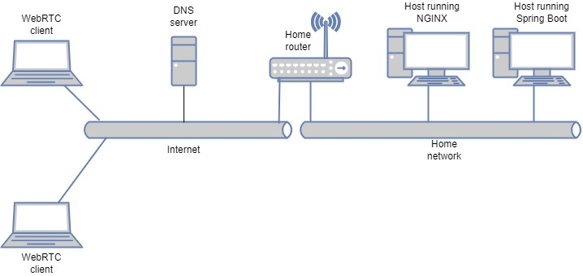

# Minus Gateway
This project is ment to be an experimentation work in progress. There are no funcional requirements or objectives, 
the only purpose is explore WebRTC, spring boot and websockets. This file provides the setup/experimentation notes.

## Network topology
The figure below sumarizes the network topology of the experimentation setup.



1. WebRTC client: Any host with a browser attached to the Internet, directly or through a fire wall
1. DNS server: A public DNS service allowing to create A type records pointing to the Home router public Ip address
1. Host running NGINX: Any Linux host running the NGINX HTTP server allowing to end the TLS session and proxy HTTP 
and WebSocket sessions to the Host running Spring Boot. 
1. Host running Spring Boot: This host may be colocated with the host running NGINX. It simply executes the 
spring boot packaged implementation.

## Setup an experimental Linux host
1. Setup a Linux host (any distribution will do), if you are using a virtual machine make sure that 
the networking is set to _bridge_ and that your virtual machine gets assigned a IP address from your home 
subnet (vs NAT). It is preferable to assign a static IP address to allow port forwarding.
1. Make sure to forward port 80 (_http_) and 443 (_https_) to the Linux host (e.g. _Gaming_ configuraiton on your home router)
1. Install [docker](https://docs.docker.com/engine/install/)
1. Get a free host name for your public IP address e.g. from [No-IP](https://www.noip.com/)

## Get TLS certificate and key from _letsencrypt_ using _certbot_ docker image on the Linux host

```bash
# Set host name (e.g. host.example.com)
export HOST_NAME=

# Requester e-mail address (e.g. some_dude@example.com), Letsencrypt will send you an email when your 
# certificate is about to expire
export EMAIL_ADDRESS=

# Stop nginx or any http server that may be running, for nginx:
sudo systemctl stop nginx

# Create some work directories
cd $HOME
mkdir cert
mkdir lock

docker run -p 80:80 -it --rm --name certbot -v "$HOME/cert:/etc/letsencrypt" \
-v "$HOME/lock:/var/lib/letsencrypt" \
certbot/certbot certonly -d $HOST_NAME --non-interactive \
--agree-tos -m $EMAIL_ADDRESS --standalone

# Change the ownership of the certificate and key files
sudo chown -R <user_name> ./cert
sudo chgrp -R <user_name> ./cert

# Rename the certificate and the key for convenience
cp ./cert/archive/$HOST_NAME/fullchain1.pem ./$HOST_NAME.crt
cp ./cert/archive/$HOST_NAME/privkey1.pem ./$HOST_NAME.key

# Remove the work directories
rm -rf ./cert ./lock
```

## Setup _nginx_ to provide an HTTPS endpoint allowing websocket forwarding
When working with _spring/spring boot_, or with 
1. Install [NGINX](https://www.nginx.com/resources/wiki/start/topics/tutorials/install/),
you should be able to get to your host using _http_ with any browser.
1. Get to the _nginx_ site configuration folder
	```bash
	sudo -s
	cd /etc/nginx/sites-available
	```
1. Create a site configuration file (e.g. ``` vi $HOST_NAME ```) with the following content
	```bash
     map $http_upgrade $connection_upgrade {
         default upgrade;
         ''      close;
     }
     
     server {
         listen              443 ssl;
         server_name         <host name>;
         ssl_certificate     <path to the certificate (*.crt) file>;
         ssl_certificate_key <path to the key (*.key) file>;
     
     
         # Proxying the HTTP request (e.g. static content)
         location / {
             proxy_pass <URL of the host running Spring Boot (e.g. http://x.y.z.w:1000)>;
         }
     
         # Proxying the web sockets
         location /gs-guide-websocket {
            proxy_pass <URL of the host running Spring Boot (e.g. http://x.y.z.w:1000)>;
            proxy_http_version 1.1;
            proxy_set_header Upgrade $http_upgrade;
            proxy_set_header Connection "Upgrade";
            proxy_set_header Host $host;
            proxy_set_header Origin "";
         }
     }

	```
1. Enable the site
	```bash
	cd /etc/nginx/sites-enabled
	ln -s ../sites-available/$HOST_NAME .
	```
1. Restart _nginx_ server
	```bash
	systemctl restart nginx
	```